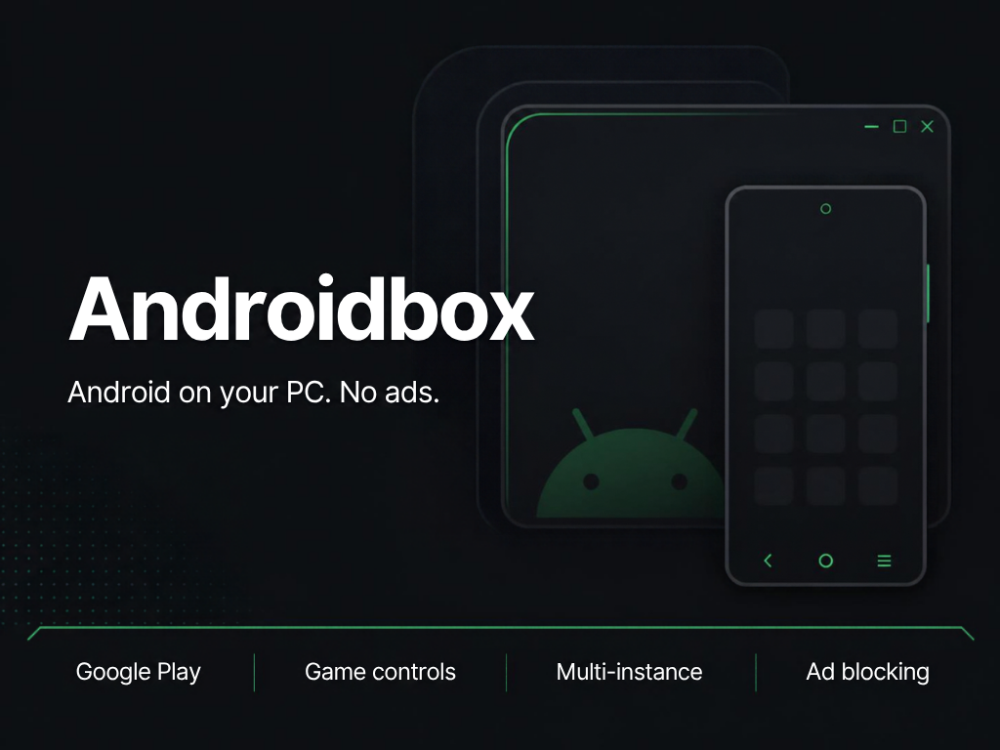
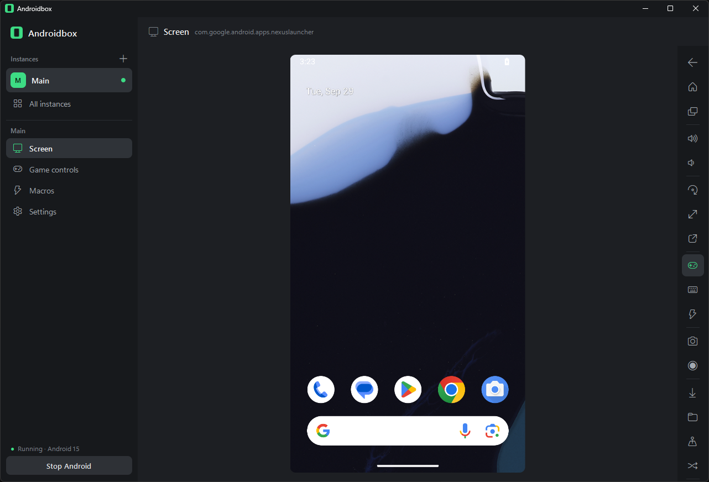
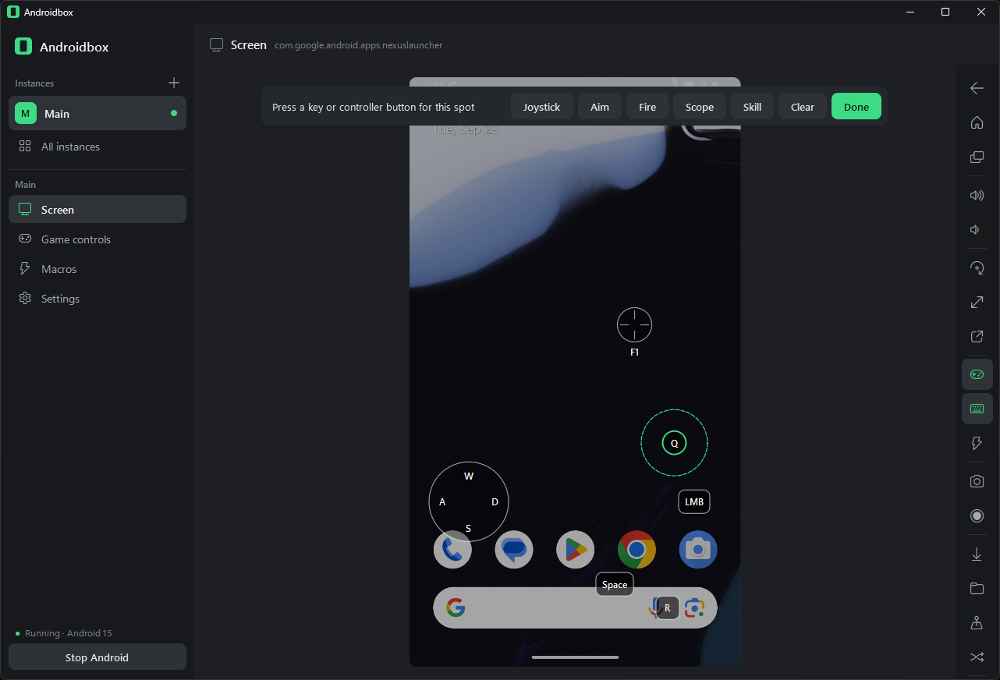
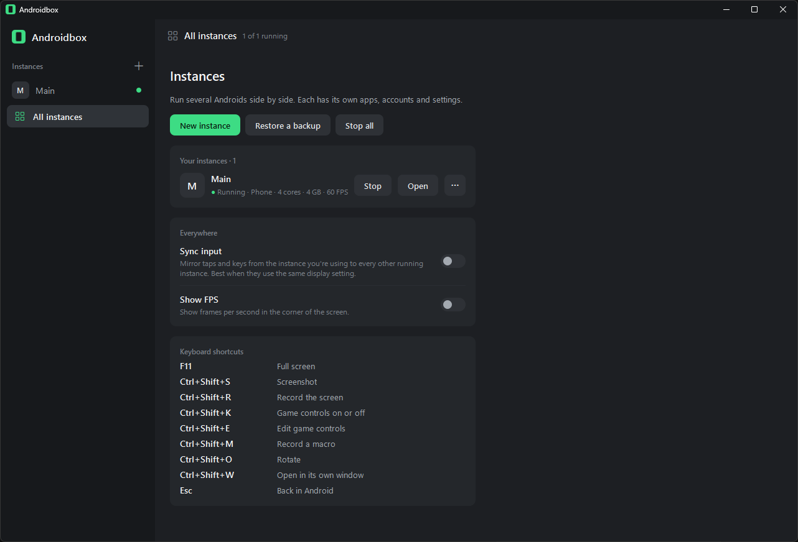
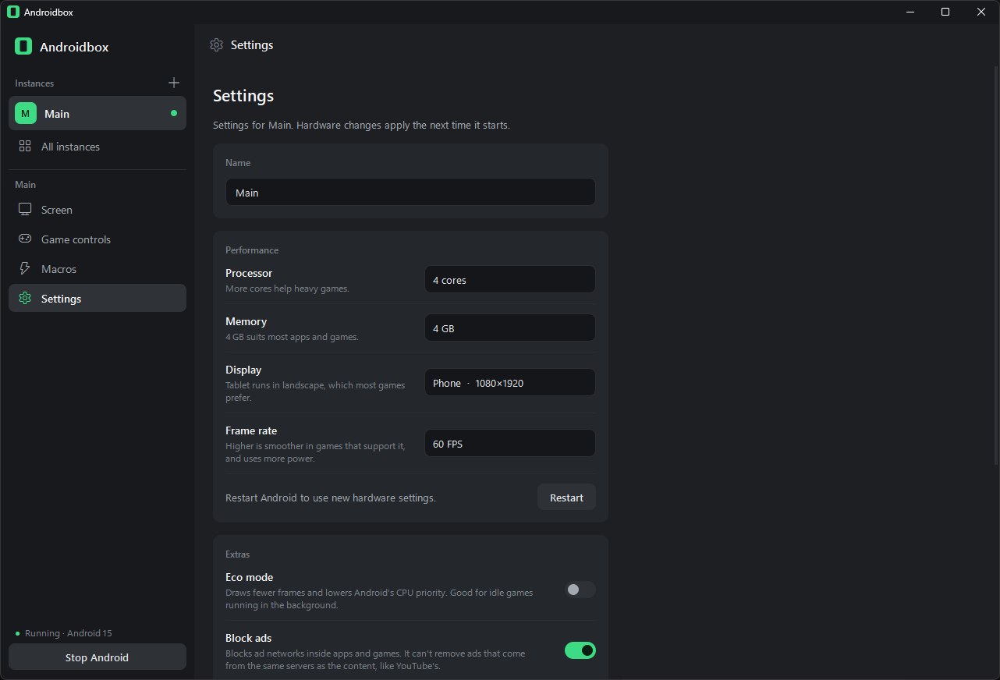
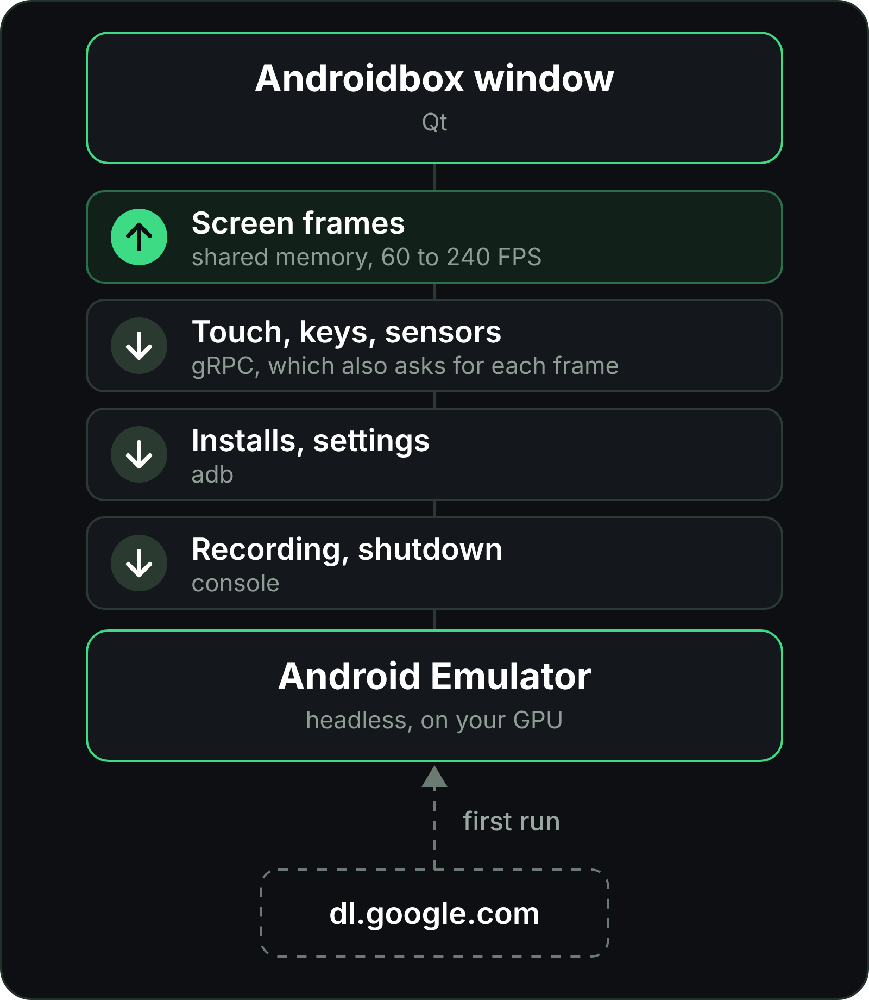

<p align="center">
  
</p>

<p align="center">
  <b>An ad-free Android emulator for Windows.</b><br>
  Google Play, game controls, multiple instances, and nothing trying to sell you anything.
</p>

<p align="center">
  <a href="https://github.com/Wolklaw/Androidbox/releases/latest"><b>Download Androidbox.exe</b></a><br>
  Windows 10 or 11 · free · MIT license
</p>

---

Androidbox runs **Google's official Android Emulator**, the same engine inside Android Studio, on your
graphics card, and shows Android in one clean window. There are no ads, no accounts to create, no
bundled apps and no telemetry. Everything it needs downloads straight from Google, and everything it
stores stays in one folder you can delete.

<p align="center"></p>

## Getting started

**You need:**
- Windows 10 or 11, 64-bit
- **Windows Hypervisor Platform** turned on. Androidbox tells you if it's off and opens the right
  settings page
- A graphics card with current drivers
- About 4 GB of disk space for Android, plus up to 10 GB per instance

**Then:**
1. Download `Androidbox.exe` from the [latest release](https://github.com/Wolklaw/Androidbox/releases/latest).
   It's a single file, so put it anywhere.
2. Open it. Windows may warn that the app is from an unknown publisher, because it isn't code-signed.
   Choose **More info**, then **Run anyway**.
3. Choose **Download and install**. This happens once.
4. Press **Start Android**.

Closing Androidbox saves and shuts down every running Android.

## Features

### Android 15 with Google Play

Runs on your GPU at 60, 90, 120, 144 or 240 FPS, with ARM apps and games supported. For older games
that only ship 32-bit ARM code, create an instance with **Android 11**, which runs both 32-bit and
64-bit ARM apps.

### Game controls

Saved separately for every game:

| Control | What it does |
|---|---|
| Tap | A key or controller button taps a spot on the screen |
| Joystick | WASD (rebindable), the D-pad or the left stick moves |
| Aim | Shooter mode: press its key (F1) and the mouse turns the camera. The right stick aims too |
| Look | Free look: the mouse turns the camera only while you hold its key (Alt) |
| Fire and Scope | The left and right mouse buttons while aiming |
| Skill | MOBA casting: hold the key, point with the mouse, release to cast |
| Turbo | Hold the key to tap the same spot rapidly |
| Swipe | One key performs a drag along an arrow you place, for dodges and lane changes |
| Zoom | Ctrl and the mouse wheel pinch in and out, with no setup |

Layouts export to a file, so you can share them or move them to another instance or PC.

<p align="center"></p>

### Controllers

Xbox, PlayStation and Switch Pro controllers, 8BitDo pads and most other gamepads work straight away,
wired or over Bluetooth. Bind their buttons and triggers like keys. Without game controls they navigate
Android: A is Enter, B is Back, Start is Home.

### Macros

Record taps, swipes and key presses once, then play them back once or on a loop, at half, normal,
double or four times the speed. Name a macro and give it a hotkey to fire it in the middle of a game.

### Profiles and sync

A profile keeps your game control layouts, macros, instance presets and preferences together. Make one
for yourself, one for streaming, one for the family PC, and switch from the menu at the top right.

- Save an instance's hardware as a **preset** and start new instances from it.
- Profiles export to a single file.
- Profiles **sync between PCs** through any folder that OneDrive, Dropbox, Google Drive or Syncthing
  already keeps up to date. Pick the folder once on each PC and your layouts, macros and presets follow
  you. There is no server and no login, and Androidbox uploads nothing itself.

### Several Androids at once

Every instance has its own apps, accounts and settings. Create, clone, back up to a single file,
restore, open any instance in its own window, tile them side by side, and mirror your input to all of
them at the same time.

<p align="center"></p>

### No ads, two ways

- **Block ads** filters ad networks inside every app and game through AdGuard DNS.
- **Ad-free browser** installs Firefox from Mozilla, makes it the default browser and opens uBlock
  Origin for you. One tap later, websites are ad-free, YouTube included.

### Let Claude Code test your apps

Off by default. Turn on **Let Claude Code control Android** in Settings and Androidbox writes a helper
script to `%LOCALAPPDATA%\Androidbox\claude`. Claude Code on your PC can then take screenshots, read
what's on screen, tap, swipe, type, install and launch apps, and read logs on your running instances.
Turn the switch off and the helper is deleted, and it refuses to run while the switch is off.

### Everything else

- Screenshots, and screen recording with no time limit (saved in 3-minute parts)
- Drag and drop to install `.apk`, `.apks` and `.xapk` files, game data included
- File import, and a clipboard shared with Windows
- Your webcam as Android's camera
- Rotate, shake, volume and GPS location
- Full screen, an FPS counter, and eco mode for idle games
- A quiet check for new Androidbox releases that you can turn off

<p align="center"></p>

## How it works

<p align="center">
  
</p>

1. **First run.** Androidbox reads Google's SDK package index, downloads the emulator, adb and the
   Android 15 system image (about 2.2 GB), checks every file's checksum, and unpacks them into
   `%LOCALAPPDATA%\Androidbox`. The Android 11 image (about 1.4 GB) only downloads the first time you
   start an instance that uses it.
2. **Starting Android.** Each instance is a standard Android virtual device. The emulator runs without
   a window of its own, uses your GPU, and resumes from a snapshot in a few seconds.
3. **Showing it.** Androidbox asks the emulator over gRPC to draw each frame, at the size of your window,
   straight into memory the two share, so frames arrive without being copied through a socket. Mouse,
   keyboard and controller input go back as multi-touch and key events.
4. **Game controls** turn keys, mouse movement and controller sticks into touches at the spots you
   placed, so they work in any game, even ones that were never built for a keyboard.
5. **Shutting down** saves a snapshot, so the next start picks up where you left off.

## Using it

- **Mouse:** left-click taps, drag swipes, the wheel scrolls, right-click is Back, middle-click is Home.
- **Keyboard:** typing goes straight to Android, and Esc is Back.
- **Files:** drop them on the screen.

| Shortcut | Action |
|---|---|
| F11 | Full screen |
| Ctrl+Shift+S | Screenshot, saved to `Pictures\Androidbox` |
| Ctrl+Shift+R | Record the screen, saved to `Videos\Androidbox` |
| Ctrl+Shift+K | Game controls on or off |
| Ctrl+Shift+E | Edit game controls |
| Ctrl+Shift+M | Record a macro |
| Ctrl+Shift+O | Rotate |
| Ctrl+Shift+W | Open in its own window |
| Ctrl+wheel | Pinch to zoom |

### Set up a game

Open the game, press Ctrl+Shift+E, click where a button is and press the key you want for it.
**Add control** at the top adds a joystick, aim, look, fire, scope, skill, turbo or swipe control. Drag
controls to move them (drag the tip of a swipe arrow to aim it), scroll over one to resize it, and
right-click to remove it. Press Done, and the layout is saved for that game.

### Record a macro

Press Ctrl+Shift+M, play, and press it again. On the Macros page you can rename a macro, change its
speed and click the hotkey box to give it a shortcut such as Ctrl+1. Macros belong to your profile and
remember the display they were recorded on, so they only play on instances with the same one.

### Share a profile between PCs

Open the profile menu at the top right, or Manage profiles for the full page. Choose **Choose a folder**
under Sync between PCs, on each PC, and pick a folder your cloud storage syncs. Instances, apps and
accounts inside Android are not part of a profile, use Back up for those.

## Tips

- **Google Play needs a Google account** to install or update apps, and some Google apps that come with
  Android ask for an update before they open. If you'd rather not sign in, install apps from `.apk`
  files and use the ad-free browser for YouTube.
- **Games need more?** Give the instance more cores and memory in Settings, or switch it to the Tablet
  display for landscape games.
- **Idle game in the background?** Turn on eco mode for that instance.
- **A game won't install or says the device isn't supported?** It probably ships 32-bit ARM code only.
  Create a new instance, pick Android 11, and install it there.
- **High refresh rate monitor?** Set the instance's frame rate to 144 or 240 FPS in Settings. Games
  that cap their own frame rate stay capped.

## FAQ

<details>
<summary><b>Is it really ad-free?</b></summary>

Androidbox itself has no ads and never will. Inside Android, Block ads stops ad networks in apps and
games, and the ad-free browser handles websites and YouTube. Ads that apps serve from their own servers
can't be filtered by any DNS blocker.

</details>

<details>
<summary><b>Does it support root?</b></summary>

No. The Google Play images can't be rooted. The upside is that banking apps and games with root
detection keep working.

</details>

<details>
<summary><b>Do I need an account?</b></summary>

No. A profile is just a name on your PC, with no password and no sign-in, and nothing about it leaves
your PC unless you pick a sync folder. Anyone who can open that folder can read the profile, so don't
share it with people you wouldn't hand your game layouts to.

</details>

<details>
<summary><b>Where is my data, and how do I remove it?</b></summary>

Everything lives in `%LOCALAPPDATA%\Androidbox`. Delete that folder, and Androidbox with all its
instances is gone. If you turned on sync, a copy of your profiles also sits in the folder you chose, in
`Androidbox Profiles`.

</details>

<details>
<summary><b>Can I run it without Google Play?</b></summary>

Yes. Skip signing in and install apps from `.apk` files.

</details>

<details>
<summary><b>Does Pokémon GO work?</b></summary>

No, and it won't. Niantic blocks emulators on purpose: the game checks Play Integrity and its own
anti-cheat, and refuses to run on any emulator, BlueStacks included. Getting around that means breaking
their terms of service and risking a ban, so Androidbox doesn't try. The GPS location tool is meant for
testing apps and games that allow it.

</details>

<details>
<summary><b>Why Android 15 and 11, and not the newest Android?</b></summary>

Google publishes Play Store images for new versions long before they are stable enough for games.
Android 15 is the newest one that runs games reliably, and Android 11 is the last one that runs 32-bit
ARM apps.

</details>

## Building

```powershell
.\build.ps1
```

This creates a virtual environment, installs the packages in `requirements.txt` plus PyInstaller, and
writes a single `dist\Androidbox.exe`. To run from source instead:

```powershell
python -m venv .venv
.venv\Scripts\pip install -r requirements.txt
.venv\Scripts\pythonw Androidbox.pyw
```

<details>
<summary><b>What's in the source</b></summary>

- `androidbox/installer.py`: downloads and verifies the emulator, adb and the system image
- `androidbox/instances.py`: instances, ports, virtual hardware, backup and restore
- `androidbox/emulator.py`: starts and stops the emulator, adb and console commands
- `androidbox/bridge.py`: the gRPC link, with the screen stream, touch and key input, and sensors
- `androidbox/keymap.py`, `gamepad.py`: game controls and controller input
- `androidbox/profiles.py`, `settings.py`: profiles, presets and the sync folder, plus preferences
- `androidbox/macros.py`, `browser.py`: macros and the ad-free browser
- `androidbox/claude.py`: the Claude Code helper script
- `androidbox/updates.py`: asks GitHub whether a newer release is out
- `androidbox/ui/`: the windows. `window.py`, `popout.py` and `host.py` lay them out, `phone.py` draws
  Android
- `androidbox/proto/`: bindings generated from the emulator's gRPC definition

</details>

## Credits

- The **Android Emulator**, its system images and its gRPC definition (`emulator_controller.proto`) are
  made by the Android Open Source Project and Google. The bindings in `androidbox/proto` are generated
  from that definition, which is licensed under the Apache License 2.0. The emulator and system images
  are downloaded from Google under the Android SDK License, which you accept on first run.
- The Android robot is reproduced or modified from work created and shared by Google and used according
  to terms described in the Creative Commons 3.0 Attribution License.
- **Firefox** is made by Mozilla, **uBlock Origin** by Raymond Hill and contributors, and **AdGuard DNS**
  by AdGuard. Androidbox only helps you install or use them.
- Built with **Qt for Python (PySide6)** and **gRPC**. Controller support comes from **SDL**, through
  PySDL2.

## License

Androidbox is released under the [MIT License](LICENSE).
