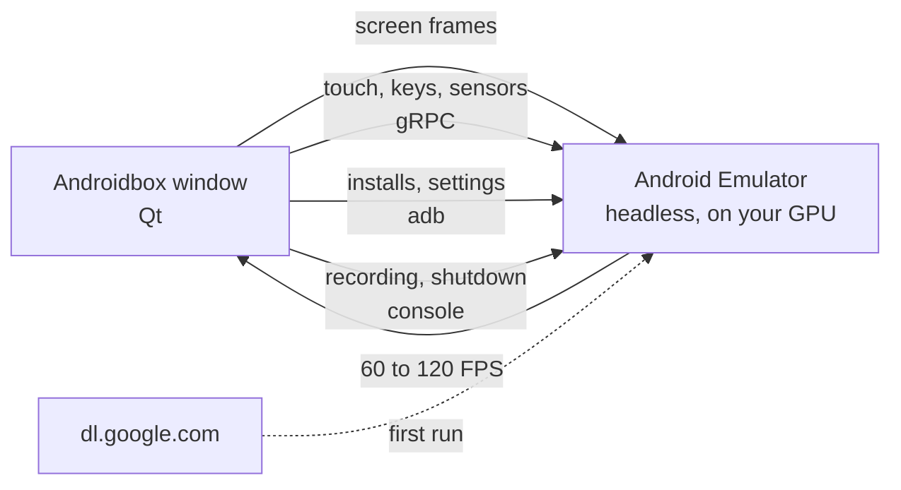

<p align="center">
  
</p>

<p align="center">
  <b>An ad-free Android emulator for Windows.</b><br>
  Google Play, game controls, multiple instances, and nothing trying to sell you anything.
</p>

---

Androidbox runs **Google's official Android Emulator**, the same engine inside Android Studio, on your
graphics card, and shows Android in one clean window. There are no ads, no accounts to create, no
bundled apps and no telemetry. Everything it needs downloads straight from Google, and everything it
stores stays in one folder you can delete.

<p align="center"></p>

## What you get

**Android 15 with Google Play**, running on your GPU at up to 120 FPS, with ARM apps and games supported.

**Game controls**, saved separately for every game:

| Control | What it does |
|---|---|
| Tap | A key or controller button taps a spot on the screen |
| Joystick | WASD (rebindable), the D-pad or the left stick moves |
| Aim | Shooter mode: press its key (F1) and the mouse turns the camera. The right stick aims too |
| Fire and Scope | The left and right mouse buttons while aiming |
| Skill | MOBA casting: hold the key, point with the mouse, release to cast |

<p align="center"></p>

**Controllers.** Xbox-style controllers work straight away, including 8BitDo pads in X-input mode.
Bind their buttons like keys. Without game controls they navigate Android: A is Enter, B is Back,
Start is Home.

**Macros.** Record taps, swipes and key presses once, then play them back once or on a loop.

**Several Androids at once.** Every instance has its own apps, accounts and settings. Create, clone,
back up to a single file, restore, open any instance in its own window, and mirror your input to all
of them at the same time.

<p align="center"></p>

**No ads, two ways.**
- **Block ads** filters ad networks inside every app and game through AdGuard DNS.
- **Ad-free browser** installs Firefox from Mozilla, makes it the default browser and opens uBlock
  Origin for you. One tap later, websites are ad-free, YouTube included.

**Everything else you'd expect:** screenshots, screen recording, drag and drop to install `.apk`,
`.apks` and `.xapk` files, file import, rotate, shake, volume, GPS location, a clipboard shared with
Windows, full screen, eco mode for idle games, and an FPS counter.

<p align="center"></p>

## How it works



1. **First run.** Androidbox reads Google's SDK package index, downloads the emulator, adb and the
   Android 15 system image (about 2.2 GB), checks every file's checksum, and unpacks them into
   `%LOCALAPPDATA%\Androidbox`.
2. **Starting Android.** Each instance is a standard Android virtual device. The emulator runs without
   a window of its own, uses your GPU, and resumes from a snapshot in a few seconds.
3. **Showing it.** Androidbox streams the screen over the emulator's gRPC interface at the size of your
   window, and sends mouse, keyboard and controller input back as multi-touch and key events.
4. **Game controls** turn keys, mouse movement and controller sticks into touches at the spots you
   placed, so they work in any game, even ones that were never built for a keyboard.
5. **Shutting down** saves a snapshot, so the next start picks up where you left off.

## Getting started

**You need:**
- Windows 10 or 11, 64-bit
- **Windows Hypervisor Platform** turned on. Androidbox tells you if it's off and opens the right
  settings page
- A graphics card with current drivers
- About 4 GB of disk space for Android, plus up to 10 GB per instance

**Then:**
1. Build `Androidbox.exe` (see [Building](#building)) or run it from source.
2. Open it and choose **Download and install**. This happens once.
3. Press **Start Android**.

Closing Androidbox saves and shuts down every running Android.

## Using it

**Mouse:** left-click taps, drag swipes, the wheel scrolls, right-click is Back, middle-click is Home.
**Keyboard:** typing goes straight to Android, and Esc is Back. **Files:** drop them on the screen.

| Shortcut | Action |
|---|---|
| F11 | Full screen |
| Ctrl+Shift+S | Screenshot, saved to `Pictures\Androidbox` |
| Ctrl+Shift+R | Record the screen, saved to `Videos\Androidbox` |
| Ctrl+Shift+K | Game controls on or off |
| Ctrl+Shift+E | Edit game controls |
| Ctrl+Shift+M | Record a macro |
| Ctrl+Shift+O | Rotate |
| Ctrl+Shift+W | Open in its own window |

**Setting up a game:** open the game, press Ctrl+Shift+E, click where a button is and press the key you
want for it. Add a joystick, aim, fire or skill control from the bar at the top. Drag controls to move
them, scroll over one to resize it, and right-click to remove it. Press Done, and the layout is saved
for that game.

## Tips

- **Google Play needs a Google account** to install or update apps, and some Google apps that come with
  Android ask for an update before they open. If you'd rather not sign in, install apps from `.apk`
  files and use the ad-free browser for YouTube.
- **Games need more?** Give the instance more cores and memory in Settings, or switch it to the Tablet
  display for landscape games.
- **Idle game in the background?** Turn on eco mode for that instance.

## FAQ

**Is it really ad-free?** Androidbox itself has no ads and never will. Inside Android, Block ads stops
ad networks in apps and games, and the ad-free browser handles websites and YouTube. Ads that apps
serve from their own servers can't be filtered by any DNS blocker.

**Does it support root?** No. The Google Play images can't be rooted. The upside is that banking apps
and games with root detection keep working.

**Where is my data, and how do I remove it?** Everything lives in `%LOCALAPPDATA%\Androidbox`. Delete
that folder, and Androidbox with all its instances is gone.

**Can I run it without Google Play?** Yes. Skip signing in and install apps from `.apk` files.

## Building

```powershell
.\build.ps1
```

This creates a virtual environment, installs the packages in `requirements.txt` plus PyInstaller, and
writes a single `dist\Androidbox.exe`. To run from source instead:

```powershell
python -m venv .venv
.venv\Scripts\pip install -r requirements.txt
.venv\Scripts\pythonw Androidbox.pyw
```

| Path | Role |
|---|---|
| `androidbox/installer.py` | Downloads and verifies the emulator, adb and the system image |
| `androidbox/instances.py` | Instances, ports, virtual hardware, backup and restore |
| `androidbox/emulator.py` | Starts and stops the emulator, adb and console commands |
| `androidbox/bridge.py` | The gRPC link: screen stream, touch and key input, sensors |
| `androidbox/keymap.py`, `gamepad.py` | Game controls and controller input |
| `androidbox/macros.py`, `browser.py` | Macros and the ad-free browser |
| `androidbox/ui/` | The windows: `window.py`, `popout.py` and `host.py` lay them out, `phone.py` draws Android |
| `androidbox/proto/` | Bindings generated from the emulator's gRPC definition |

## Credits

- The **Android Emulator**, its system images and its gRPC definition (`emulator_controller.proto`) are
  made by the Android Open Source Project and Google. The bindings in `androidbox/proto` are generated
  from that definition, which is licensed under the Apache License 2.0. The emulator and system images
  are downloaded from Google under the Android SDK License, which you accept on first run.
- The Android robot is reproduced or modified from work created and shared by Google and used according
  to terms described in the Creative Commons 3.0 Attribution License.
- **Firefox** is made by Mozilla, **uBlock Origin** by Raymond Hill and contributors, and **AdGuard DNS**
  by AdGuard. Androidbox only helps you install or use them.
- Built with **Qt for Python (PySide6)** and **gRPC**.
